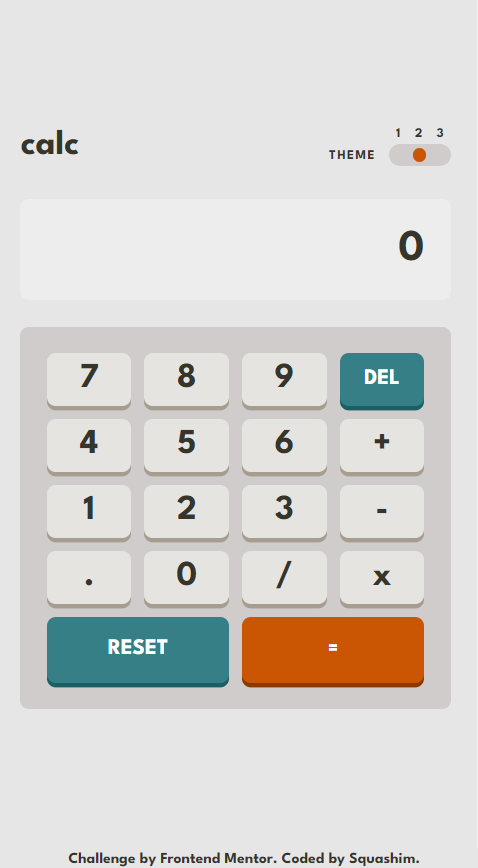
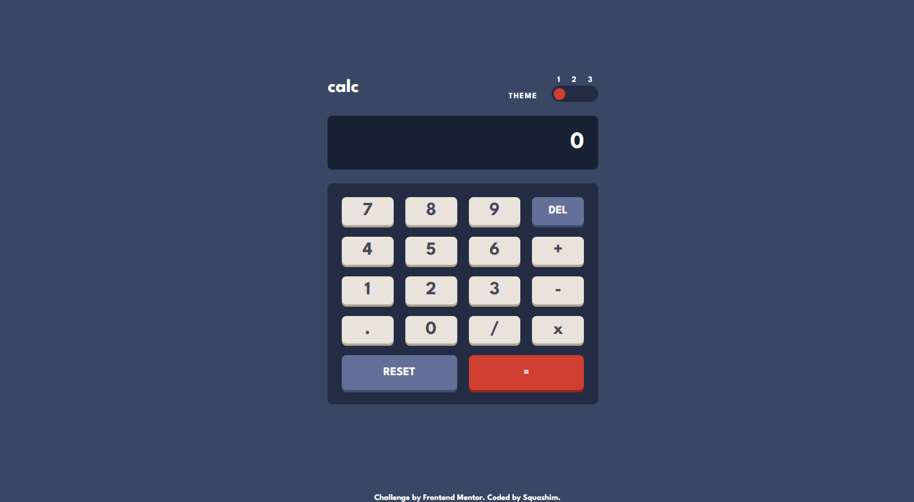

# Frontend Mentor - Calculator app

## Table of contents

- [Screenshot](#screenshot) 
- [The challenge](#the-challenge)
- [Links](#links)
- [Author](#author)
### Screenshot

<table>
        <tr>
            <td>
                
            </td>
            <td>
                
            </td>
        </tr>
</table>

## The challenge

Your challenge is to build out this calculator app and get it looking as close to the design as possible.

You can use any tools you like to help you complete the challenge. So if you've got something you'd like to practice, feel free to give it a go.

Your users should be able to:

- See the size of the elements adjust based on their device's screen size
- Perform mathematical operations like addition, subtraction, multiplication, and division
- Adjust the color theme based on their preference
- **Bonus**: Have their initial theme preference checked using `prefers-color-scheme` and have any additional changes saved in the browser

**Have fun building!** 🚀
